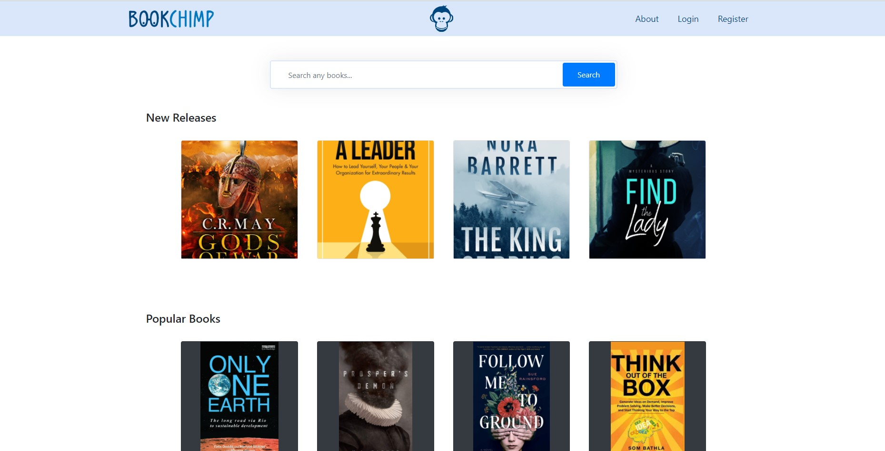

# Book Chimp
 A web app built using the `Node.js`, `Express`, `MongoDB`, and ` EJS Template MVC` for a university project.


# 

<br>

## 🔴 **Live Demo**
<br>

### You can check the website live [here](https://bookchimp-v1.herokuapp.com/home)


<br>


<br>

## 😎 **Quick start**

<br>

First, [download](https://nodejs.org/en/download/) and install **Node.js**. (Preferred to use the LTS version)

Let's now install our dependencies **required modules** using npm:
`(make sure you are in the root directory where package.json is located)`

```bash
npm install
```

Next, just run the whole thing using `npm`

```bash
npm run start
```

That's all you need to know to start! ✅


<br>
<br>
  
## ⚒️ **Built with**

<br>


- [JavaScript](https://developer.mozilla.org/en-US/docs/Learn/JavaScript/First_steps/What_is_JavaScript) - JavaScript is a scripting or programming language that allows you to implement complex features on web pages 

- [Node.js](https://nodejs.org/) - Node.js® is a JavaScript runtime built on Chrome's V8 JavaScript engine.


- [MongoDB](https://www.mongodb.com/) - MongoDB is a source-available cross-platform document-oriented database program. Classified as a NoSQL database program, MongoDB uses JSON-like documents with optional schemas.

- [EJS](https://ejs.co/) - EJS is a simple templating language that lets you generate HTML markup with plain JavaScript. No religiousness about how to organize things. No reinvention of iteration and control-flow. It's just plain JavaScript.

<br>


## 🚩 [License](https://github.com/mostafa-aboelnaga/Book-Chimp/blob/main/LICENSE)

MIT © [Mostafa Aboelnaga](https://github.com/mostafa-aboelnaga/)


